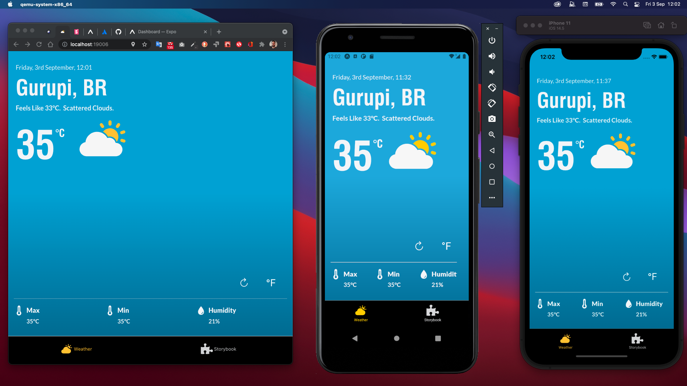
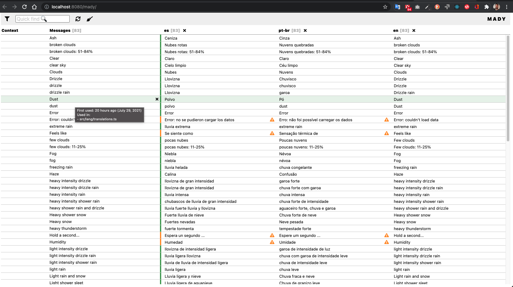
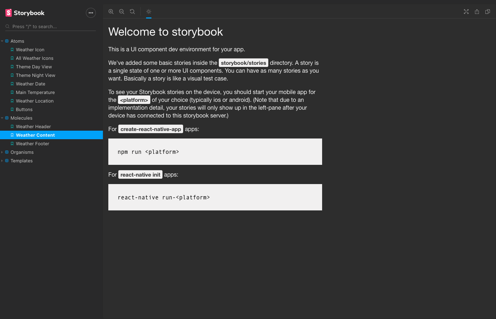

# Weather App Demo 

<!-- To update this table of contents, ensure you have run `yarninstall` then `yarn doctoc` -->
<!-- START doctoc generated TOC please keep comment here to allow auto update -->
<!-- DON'T EDIT THIS SECTION, INSTEAD RE-RUN doctoc TO UPDATE -->

## Table of Contents

- [About](#about)
  - [PWA Demonstration](#pwa-demonstration)
- [Install and Run](#install-and-run)
- [Project Structure](#project-structure)
- [Translation](#translation)
- [Storybook](#storybook)
- [Documentation](#documentation)
- [License](#license)

<!-- END doctoc generated TOC please keep comment here to allow auto update -->

<a id="about"></a>

## About

Weather Map is a demo project in [React-Native](https://reactnative.dev/). It runs embedded the Storybook with the components decoupled using Atomic Design pattern.

<a id="demonstration"></a>

### PWA Demonstration

Access the link [Weather App Demonstration](https://weather-appd.firebaseapp.com/).

<p></p>

<a id="intstall-and-run"></a>

## Install and Run

To **install** and run just clone it and run.

```sh
yarn install
```

and then, to start, run

```sh
yarn start
```

For Android run

```sh
yarn android
```

For iOS run

```sh
yarn ios
```

For Web (expo), run

```sh
yarn web
```

The **Metro** Blunder will be available at [http://localhost:19002/](http://localhost:19002/) by default.

<a id="project-structure"></a>

## Project Structure

The project folder structure respect the **Feature based** development. Each **Feature** folder contain the same structure being some folders optional. All of them refers to the **App Feature** as base for styles, contexts, services, constants, components etc... but can contain one or more of these as needed.

```sh
.
├── assets                          # Compilation assets
├── docs                            # Typedoc documentation
├── android                         # Android Source Code4
├── ios                             # iOS Source Code
├── public                          # public folder for Web generation
├── src
│   ├── @types
│   ├── app                         # App Feature (default)
│   │   ├── assets                  # Application Assets (icons | fonts)
│   │   ├── components              # Atomic design
│   │   │    ├── atoms              # Atoms Components
│   │   │    ├── molecules          # Molecules Components
│   │   │    ├── organisms          # Organisms Components
│   │   │    ├── templates          # Templates Components
│   │   ├── constants               # Project Constants
│   │   ├── contexts                # React Contexts, Context Interfaces and Reducers
│   │   │    ├── app                # App Context and App Reducer
│   │   ├── hooks                   # Custom Hooks
│   │   ├── locales                 # Traslations (Mady)
│   │   ├── navigation              # Navigation container
│   │   ├── screens                 # Screens
│   │   ├── services                # Storage Api
│   │   ├── styles                  # Global styles
│   │   └── providers               # Auxiliar functions and classes
│   │   types...                    # Entities and Types
├── storybook                       # Storybook Feature
│   └── ...                         # ... uses the same structure from App Featrure
├── weather                         # Weather Feature
│   └── ...                         # ... uses the same structure from App Featrure
└── ...
```

<a id="translation"></a>

## Translation

As an example of translation capabilities, it was added to this project, the support for three languages `pt-br`, `en`, `es` and to generate de translations it was used [Mady](https://guigrpa.github.io/mady/) a local hosting tool for translation management.

To run **Mady** just type in the terminal

```sh
yarn translate
```

and the local app will be availabla at [http://localhost:8080/mady/](http://localhost:8080/mady/).

<p></p>

<a id="storybook"></a>

## Storybook

The storybook framework was used to provide documentation for common graphic components, like buttons, toasts, inputs and templates.

To run **StoryBook** just type in terminal

```sh
yarn storybook
```

and the local app will be available at [http://localhost:7007/](http://localhost:7007/).

<p></p>

## Documentation

Documentation generation run Typedoc

```sh
yarn typedoc
yarn serve:docs
```

Access de generated documentation from
[http://127.0.0.1:8080](http://127.0.0.1:8080)

For README.md, run

```sh
yarn doctoc
```

## License

MIT License

Copyright (c) 2021 Daniel

Permission is hereby granted, free of charge, to any person obtaining a copy
of this software and associated documentation files (the "Software"), to deal
in the Software without restriction, including without limitation the rights
to use, copy, modify, merge, publish, distribute, sublicense, and/or sell
copies of the Software, and to permit persons to whom the Software is
furnished to do so, subject to the following conditions:

The above copyright notice and this permission notice shall be included in all
copies or substantial portions of the Software.

THE SOFTWARE IS PROVIDED "AS IS", WITHOUT WARRANTY OF ANY KIND, EXPRESS OR
IMPLIED, INCLUDING BUT NOT LIMITED TO THE WARRANTIES OF MERCHANTABILITY,
FITNESS FOR A PARTICULAR PURPOSE AND NONINFRINGEMENT. IN NO EVENT SHALL THE
AUTHORS OR COPYRIGHT HOLDERS BE LIABLE FOR ANY CLAIM, DAMAGES OR OTHER
LIABILITY, WHETHER IN AN ACTION OF CONTRACT, TORT OR OTHERWISE, ARISING FROM,
OUT OF OR IN CONNECTION WITH THE SOFTWARE OR THE USE OR OTHER DEALINGS IN THE
SOFTWARE.
